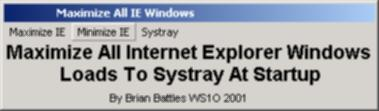



## MaxIE

### Description

Small app sits in SysTray and lets user maximize or minimize all running instances of Internet Explorer, handy when you've been popping links open in separate windows all over the place. Uses API calls so it's quick.
 
### More Info
 

             |
---                |---
**Submitted On**   |2001-07-11 16:34:02
**By**             |[Brian Battles WS1O](https://github.com/Planet-Source-Code/PSCIndex/blob/master/ByAuthor/brian-battles-ws1o.md)
**Level**          |Intermediate
**User Rating**    |5.0 (15 globes from 3 users)
**Compatibility**  |VB 6\.0
**Category**       |[Complete Applications](https://github.com/Planet-Source-Code/PSCIndex/blob/master/ByCategory/complete-applications__1-27.md)
**World**          |[Visual Basic](https://github.com/Planet-Source-Code/PSCIndex/blob/master/ByWorld/visual-basic.md)
**Archive File**   |[MaxIE225757112001\.zip](https://github.com/Planet-Source-Code/brian-battles-ws1o-maxie__1-24913/archive/master.zip)

### API Declarations

See code

